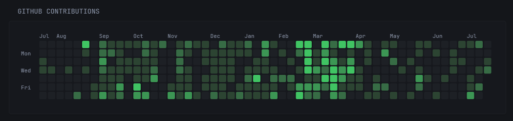
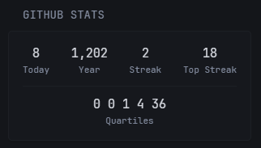

# glance-github-graph

A lightweight [Glance](https://github.com/glanceapp/glance) extension for generating GitHub contribution graphs and statistics.

## Installation

```yml
services:
  glance-github-graph:
    image: haumea/glance-github-graph:latest
    ports:
      - 8080:8080
    environment:
      - CACHE_ENABLED=true
      - CACHE_TYPE=memory
      - CACHE_DURATION_SECS=3600
```

### Environment variables

| Variable | Default | Description |
|----------|---------|-------------|
| `CACHE_ENABLED` | `false` | Enable caching (true/false) |
| `CACHE_TYPE` | `memory` | Cache type: `memory` or `file` |
| `CACHE_DURATION_SECS` | `3600` | Cache duration in seconds |
| `CACHE_FILE_PATH` | `cache.json` | File cache path (when using file cache) |

## Glance configuration

> [!TIP]
> All query parameters are optional, with sane defaults.

### Graph

Centered contribution graph.



```yml
- type: extension
  url: http://glance-github-graph:8080/graph/<your-username>
  allow-potentially-dangerous-html: true
  parameters:
    background-color: "#1d2025" # cell background
    primary-color: "#f3afaf" # cell foreground
    svg-height: 150 # height for graph svg
    show-months: true # show months on the graph
    show-weekdays: true # show weekdays on the graph
    font-size: 9 # size of weekdays & months text on graph

    # if true, it will transition the hue from background
    # to primary color per the number of commits.
    # otherwise it will just use the background hue for
    # 0 commits and the foreground hue for all others
    transition-hue: false 
```

### Stats

Statistics summary.



```yml
- type: extension
  url: http://glance-github-graph:8080/stats/<your-username>
  allow-potentially-dangerous-html: true
  parameters:
    show_quartiles: true # whether to include "quartiles" in the stats
```

### Graph SVG

Just the pure svg image of the graph.


```yml
- type: extension
  url: http://glance-github-graph:8080/graph_svg/<your-username>
  allow-potentially-dangerous-html: true
  parameters:
    ... # accepts all the same parameters as /graph/
```
